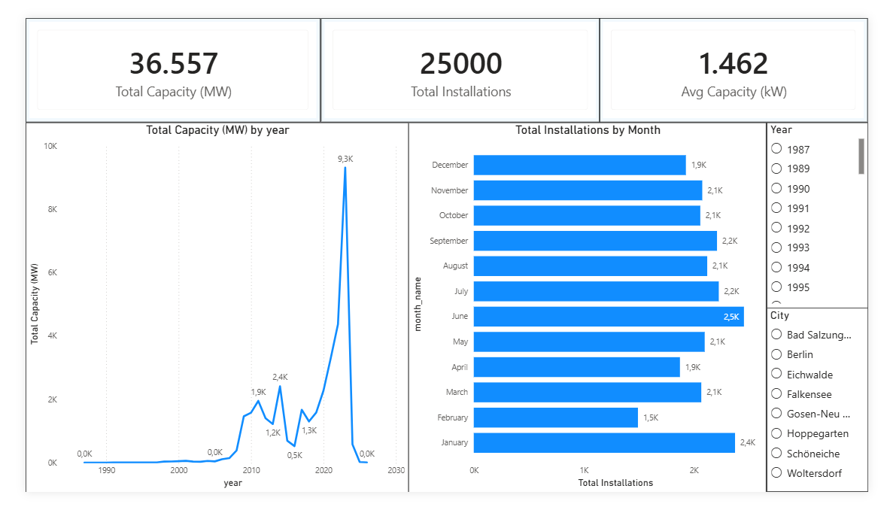

# Berlin Solar Analytics — ELT Pipeline & Dimensional Model



An end-to-end analytics engineering project built on the **German
Marktstammdatenregister (MaStR)** — the federal registry of every electricity
generating unit in Germany. This pipeline ingests the raw Berlin solar extract,
cleans it, and models it into a tested star schema ready for BI consumption.

**25,000 solar installations · 263.6 MW total capacity · 196 postal codes ·
39 years of commissioning history (1987–2026)**

---

## Project Overview

Germany's MaStR is real, messy, public infrastructure data. It ships with German
column names, mixed-type date columns, locale-dependent decimal separators, and
a file whose extension lies about its format. This project treats those problems
as the substance of the work rather than an afterthought.

The pipeline follows a standard **ELT** pattern:

- **Extract & Load** — a Python script parses the raw MaStR export, maps German
  column names to clean English ones, normalises German number and date
  formats, and lands the result in a DuckDB `raw` schema. No business logic.
- **Transform** — dbt builds a staging view over the raw table, then derives a
  star schema (one fact, two dimensions) in the `main` schema.
- **Test** — 36 dbt data quality tests assert primary key uniqueness, null
  constraints, value domains, and referential integrity across the model.

**Key metrics from the modelled data**

| Metric | Value |
|---|---|
| Installations | 25,000 |
| Total installed capacity | 263.6 MW |
| Mean capacity | 10.55 kW |
| Median capacity | 6.12 kW |
| Capacity range | 0.003 kW – 2,210.9 kW |
| Commissioning window | 1987-05-09 – 2026-09-01 |
| Peak year | 2023 (9,761 installs, 69.9 MW) |

The gap between the 10.55 kW mean and the 6.12 kW median reflects a
long-tailed distribution: thousands of residential rooftop and balcony systems
alongside a handful of utility-scale sites. Any capacity analysis should
segment before averaging.

---

## Key Dashboard Insights

The Power BI dashboard above sits directly on the exported star schema. Three
findings stand out.

### 1. Fleet scale — 263.6 MW across 25,000 units

Total installed capacity is **263.6 MW** (263,631.5 kW) of gross capacity
(*Bruttoleistung*). The equivalent net figure (*Nettonennleistung*) is
232.8 MW — a 12% derating that matters for any yield modelling.

### 2. Unit size — a residential fleet with a long tail

| Statistic | Value |
|---|---|
| Mean capacity | 10.55 kW |
| Median capacity | 6.12 kW |
| Smallest unit | 0.003 kW |
| Largest unit | 2,210.9 kW |

The mean sits **72% above the median**, which is the signature of a
rooftop-dominated fleet with a handful of commercial-scale outliers. Reporting
the mean alone would overstate the typical Berlin installation; the median is
the honest headline number.

### 3. Growth — the 2012 EEG peak, the 2013 cliff, and the 2023 surge

German solar policy is legible directly in the commissioning curve:

| Year | Installations | Capacity added | Context |
|---|---|---|---|
| 2011 | 851 | 12.19 MW | Feed-in tariff era |
| **2012** | **672** | **12.21 MW** | **EEG-era capacity peak** |
| 2013 | 531 | 5.85 MW | −52% after tariff cuts |
| 2021 | 1,892 | 26.19 MW | Recovery |
| 2022 | 3,653 | 32.66 MW | Energy-price shock |
| **2023** | **9,761** | **69.95 MW** | **Post-crisis surge** |

Two distinct booms, driven by different forces. **2012** was the high-water
mark of the *Erneuerbare-Energien-Gesetz* feed-in tariff — generous guaranteed
rates pulled capacity forward, and the subsidy cuts that followed cut annual
additions by more than half within a single year. **2023** was demand-led
rather than subsidy-led: post-2022 energy prices drove **9,761 installations —
14.5× the 2012 unit count and 5.7× its capacity**, and the single largest year
in the dataset by a wide margin.

The two peaks are also qualitatively different. 2012 added its capacity through
fewer, larger systems (18.2 kW average); 2023 added far more capacity through
many smaller ones (7.2 kW average) — the fingerprint of mass residential and
balcony-solar adoption rather than commercial projects.

> **Reading the trend line:** this extract is the first 25,000 units of a larger
> MaStR result set (source sheet `Stromerzeuger_1_to_25000`), so annual figures
> are not complete counts of Berlin solar. The *shape* of the curve is
> meaningful; the absolute totals for the most recent years are not — 2024
> onward is thin because of where the extract was cut, not because installation
> stopped.

---

## Tech Stack

| Layer | Technology | Role |
|---|---|---|
| Ingestion | **Python 3.14**, pandas, openpyxl | Parsing, encoding/delimiter detection, type normalisation |
| Warehouse | **DuckDB** | Embedded OLAP database — zero-config, single file, columnar |
| Transformation | **dbt-core** + **dbt-duckdb** | Modelling, dependency graph, testing, documentation |
| Language | **SQL** (DuckDB dialect), **Jinja** | Model logic and templating |
| Configuration | python-dotenv | Environment-driven paths and schema names |
| Consumption | **Power BI / Tableau** | Target BI layer — the star schema is shaped for direct connection |

> **Scope note:** the pipeline and dimensional model are complete and tested.
> No BI dashboard is included in this repository; the star schema is the
> deliverable that a BI tool connects to.

---

## Architecture

```
┌──────────────────────────────┐
│  raw_master_solar.csv.xlsx   │   MaStR export, 64 German columns
└──────────────┬───────────────┘
               │  load_raw_data.py
               │  · format detection via magic bytes (XLSX vs CSV)
               │  · encoding fallback (utf-8 / utf-8-sig / latin1)
               │  · delimiter sniffing (';' vs ',')
               │  · German decimal commas  '1.234,5' -> 1234.5
               │  · mixed-type date parsing -> DATE
               ▼
┌──────────────────────────────┐
│  raw.raw_solar_installations │   DuckDB · 25,000 rows · 7 typed columns
└──────────────┬───────────────┘
               │  dbt · {{ source() }}
               ▼
┌──────────────────────────────┐
│ main.stg_solar_installations │   VIEW · trim, coalesce, filter to operating
└──────────────┬───────────────┘
               │  dbt · {{ ref() }}
               ▼
        ┌──────┴────────┬──────────────┐
        ▼               ▼              ▼
┌───────────────┐ ┌───────────┐ ┌──────────────────┐
│ dim_geography │ │ dim_date  │ │ fct_installations│
│     (196)     │ │  (4,729)  │ │     (25,000)     │
└───────────────┘ └───────────┘ └──────────────────┘
```

### Dimensional Model — Star Schema

```
              ┌─────────────────────────┐
              │      dim_geography      │
              ├─────────────────────────┤
              │ geo_id        PK  (md5) │
              │ city                    │
              │ state                   │
              │ postal_code             │
              └────────────┬────────────┘
                           │ 1
                           │
                           │ ∗
              ┌────────────┴────────────┐
              │    fct_installations    │
              ├─────────────────────────┤
              │ installation_id  PK     │
              │ geo_id           FK ────┼──> dim_geography
              │ install_date     FK ────┼──> dim_date
              │ capacity_kw      measure│
              └────────────┬────────────┘
                           │ ∗
                           │
                           │ 1
              ┌────────────┴────────────┐
              │        dim_date         │
              ├─────────────────────────┤
              │ install_date  PK        │
              │ year                    │
              │ quarter                 │
              │ month                   │
              │ month_name              │
              │ day_of_month            │
              │ year_quarter            │
              │ year_month              │
              └─────────────────────────┘
```

**Grain:** `fct_installations` holds exactly one row per solar unit — 25,000
rows, 25,000 distinct `installation_id`. Both dimension joins are verified
non-fanning.

**Design decisions**

- **Hash surrogate keys.** `geo_id` is `md5(city|state|postal_code)`. A
  `row_number()` key would reshuffle on every full refresh and silently
  invalidate anything that had stored it; a hash of the natural key is stable.
- **Explicit `'Unknown'` members.** Staging coalesces missing geography to
  `'Unknown'` rather than leaving NULLs, so dimension joins can be inner joins
  without ever dropping a fact row.
- **No package dependencies.** The `capacity_kw >= 0` range check is a local
  generic test (`macros/non_negative.sql`) instead of
  `dbt_utils.accepted_range`, keeping the project free of a `dbt deps` step.

---

## Data Quality & Testing

`dbt test` runs **36 tests — all passing, 0 errors, 0 warnings.**

| Category | Count | Coverage |
|---|---|---|
| `not_null` | 23 | Every column across all four models |
| `unique` | 5 | All primary keys plus the `postal_code` natural key |
| `accepted_values` | 4 | `status`, `quarter`, `month`, `month_name` domains |
| `relationships` | 2 | Both fact → dimension foreign keys |
| `non_negative` (custom) | 2 | `capacity_kw` in staging and fact |

Distributed across models: `dim_date` 13, `stg_solar_installations` 10,
`dim_geography` 7, `fct_installations` 6.

**Referential integrity is explicitly enforced.** The two `relationships` tests
assert that every `geo_id` and `install_date` in `fct_installations` resolves to
its dimension — the check that catches a broken join before a dashboard does.

Verified independently in DuckDB: 0 orphan foreign keys, 25,000 distinct IDs
across 25,000 fact rows, and no row loss between the raw layer and the fact
table.

### Data quality problems solved during ingestion

These are the substantive engineering problems in this dataset, each verified
against all 25,000 rows rather than assumed:

1. **The source file is an XLSX named `.csv.xlsx`.** Detected by ZIP magic
   bytes, not extension. The loader handles both formats.
2. **Mixed-type date column.** 9,342 cells arrived as real Excel datetimes and
   15,658 as text. Profiling proved the text format is US month-first
   (`M/D/YYYY`): zero values have a first component > 12, while all 15,658 have
   a second component > 12. **Parsing these as German `%d.%m.%Y` would have
   silently corrupted the dates with no error raised** — the kind of bug that
   surfaces months later in a trend chart.
3. **Abbreviated column headers.** The ID column is `MaStR-Nr. der Einheit`,
   not `MaStR-Nummer der Einheit`. Mapping resolves through an alias list
   normalised against case and punctuation.
4. **Postal codes as integers.** Excel strips leading zeros, so `01067` arrives
   as `1067`. Re-padded to 5 characters and stored as text — postal codes are
   identifiers, not numbers.
5. **German decimal separators.** `1.234,5` → `1234.5`, handled for the CSV
   path where dots are thousands separators and commas are decimal points.

---

## How to Reproduce

### Prerequisites

Python 3.9+ and the raw MaStR export in the project root.

### 1. Install dependencies

```bash
python -m pip install -r requirements.txt
```

### 2. Build the raw layer

```bash
python load_raw_data.py
```

Creates `solar_berlin.duckdb` and loads `raw.raw_solar_installations`. The
script prints its column mapping, a data quality profile, and the first 5 rows
read back from DuckDB. Full-refresh: safe to re-run.

### 3. Build the dimensional model

```bash
python -m dbt.cli.main run
```

Expected: `PASS=4 WARN=0 ERROR=0 SKIP=0 TOTAL=4`

### 4. Run the data quality tests

```bash
python -m dbt.cli.main test
```

Expected: `PASS=36 WARN=0 ERROR=0 SKIP=0 TOTAL=36`

### 5. Export for BI tools

```bash
python export_for_bi.py
```

Writes each star schema table to `exports/` as both CSV and Parquet, verifies
the round-trip by re-reading every file from disk, and reports any column whose
type a CSV reader would infer differently from the warehouse.

**Use the Parquet files in Power BI or Tableau.** They carry a real schema, so
types load correctly with no manual configuration. The CSVs are provided for
interchange; because CSV has no type system, two hazards apply on import:

- **`postal_code` re-infers as an integer** and must be set to text, or leading
  zeros are lost.
- **`capacity_kw` is corrupted by a German-locale import.** Under de-DE, `.` is
  a thousands separator, so `11.96` loads as `1196` and `4.225` as `4225`.
  Because the inflation depends on decimal places (×10, ×100 or ×1000), totals
  are not merely rescaled but differentially distorted — the whole column reads
  138.67× high. Set the column type with locale **English (United States)**, or
  simply load the Parquet file, where the value is already a typed `DOUBLE`.

`exports/_schema.json` documents the intended type for every column, plus the
join keys and grain.

### 6. Query the star schema

```bash
python -c "import duckdb; print(duckdb.connect('solar_berlin.duckdb').execute('''select d.year, count(*) as installs, round(sum(f.capacity_kw)/1000,1) as mw from main.fct_installations f join main.dim_date d using (install_date) join main.dim_geography g using (geo_id) group by 1 order by 1 desc limit 10''').df())"
```

### Notes

- Run all commands from the project root. `profiles.yml` lives there rather
  than in `~/.dbt`, and dbt resolves it from the working directory.
- Use `python -m dbt.cli.main` and `python -m pip` if the `dbt` and `pip`
  executables are not on your PATH.
- `python -m dbt.cli.main build` runs models and tests together in dependency
  order.

---

## Project Structure

```
berlin-solar-dataset/
├── load_raw_data.py            # Extract & Load: MaStR export -> DuckDB raw schema
├── export_for_bi.py            # Export star schema -> exports/ as CSV + Parquet
├── requirements.txt
├── dbt_project.yml             # dbt project config (solar_transformations)
├── profiles.yml                # dbt-duckdb connection -> ./solar_berlin.duckdb
├── models/
│   ├── schema.yml              # Model/column docs + 36 data quality tests
│   ├── staging/
│   │   ├── _sources.yml        # Source definition for raw.raw_solar_installations
│   │   └── stg_solar_installations.sql
│   └── marts/
│       ├── dim_geography.sql
│       ├── dim_date.sql
│       └── fct_installations.sql
├── macros/
│   └── non_negative.sql        # Custom generic test: numeric range check
├── exports/                    # BI-ready outputs (CSV + Parquet + _schema.json)
├── CLAUDE.md                   # Engineering context & dataset gotchas
└── README.md
```

---

## Known Limitations

Stated explicitly rather than left for a reader to discover:

- **`dim_date` is sparse, not a continuous date spine.** It contains only dates
  present in the facts, so a month with zero installations produces no row.
  Continuous trend lines require a generated spine (`generate_series` over the
  full range) with the fact left-joined onto it.
- **`install_date` extends to 2026-09-01**, beyond the present. These are
  genuine MaStR records carrying registered or planned commissioning dates, not
  parse errors — but they should be filtered for any "installed to date" metric.
- **`state` and `status` are constant** (`Berlin` / `In Betrieb`) across all
  25,000 rows. This is a pre-filtered extract, so those columns carry no
  analytical signal in their current form.
- **The extract is a slice of the registry.** The source sheet is named
  `Stromerzeuger_1_to_25000` — the first 25,000 units of a larger result set,
  not the complete Berlin population. Annual totals for the most recent years
  are truncated as a result and should not be read as installation counts.
- **`city` contains a source tagging error.** 18 of 25,000 rows carry seven
  non-Berlin municipalities (Hoppegarten, Schöneiche, Woltersdorf, Eichwalde,
  Gosen-Neu Zittau, Falkensee, Bad Salzungen). All seven lie outside Berlin —
  six in Brandenburg, one in Thüringen — yet every row is tagged
  `Bundesland = 'Berlin'` upstream. The pipeline preserves the source value
  rather than silently rewriting it; a geography-accurate analysis should
  reconcile `city` against `postal_code`.
- **Ingestion is full-refresh only.** There is no incremental or
  change-data-capture path.
- **`capacity_kw` maps to `Bruttoleistung`** (gross). The source also carries
  `Nettonennleistung` (net), which differs meaningfully — 11.96 vs 9.0 kW on the
  first record. Analyses needing net output require a second measure.

---

## Data Source

[Marktstammdatenregister](https://www.marktstammdatenregister.de/MaStR) —
the German Federal Network Agency (Bundesnetzagentur) registry of electricity
and gas generating units. Publicly available.
